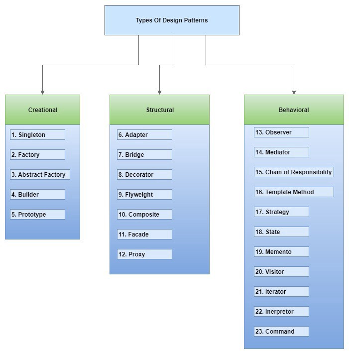

# Study About Design Pattern's

This repository is about some projects and documentation about
design pattern's in Java.

## Samples

* [Singleton](./patterns/singleton/)
* [Factory Method](./patterns/factory-method/)

## Motivation

### Benefits

Design Pattern have two major benefits:

1. Provide a way to solve issues related to software development using a
   proven solution. The solution facilities the development of highly
   cohesive modules and minimal coupling. They isolate the variability
   that may exist in the system requirements, making the overall system
   easier to understand and maintain
1. Make communication between designers more efficient. Software
   professionals can immediately picture the high level design in their
   heads when they refer the name of the pattern used to solve a
   particular issue when discussing system design

## Template

|Term|Description|
|---|---|
|Pattern Name|Describes the essence of the pattern in a short, but expressive, name|
|Intent|Describes what the pattern does|
|Also Known As|List any synonyms for the pattern|
|Motivation|Provides an example of a problem and how the pattern solves that problem|
|Applicability|Lists the situation where the pattern is applicable|
|Scructure|Set of diagrams of the classes and objects that depict the pattern|
|Participants|Describes the classes and objects that participate in the design pattern and their responsabilities|
|Collaborations|Describes how the participants collaborate to carry out their responsabilities|
|Consequences|Describes the forces that exist with the pattern and the benefits, trade-offs, and the variable that is isolated by the pattern|
