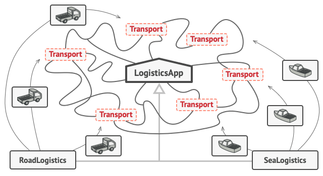

# Factory Method

**Factory Method** is a `creational design pattern` that provides an interface for creating objects in a `superclass`,
but allows
`subclasses` to alter the type of objects that will be created

## Doubts

* What the difference between using `Abstract Classes` and `Interface`?

## Also Know As

## Motivation

Imagine that we creating a logistics management application. The first version of our app we can only handle
transportation by trucks, so the bulk of you code lives inside the `Truck` class.

After a while, our app becomes pretty popular. Each day we receive dozens of requests from sea transportation companies
to incorporate sea logistics into the app.

*Adding a new class to the program isn't that simple if the rest of the code is already coupled to existing classes*

Great news, right? But how about the code? At present, most of our code is coupled to the `Truck` class. Adding `Ships`
into the app would require making changes to the entire code base. Moreover, if later we decide to add another type of
transportation to the app, we will probably need to make all of these changes again.

As a result, we will end up with pretty nasty code, riddled with conditionals that switch the app's behavior depending
on the class of transportation objects.

## Solution

The Factory Method pattern suggests that you replace direct object construction calls (using the `new` operator) with
calls to a special
*factory* method. The objects are still created via the `new` operator, but it's being called from within the factory
method. Objects returned by a factory method are often referred to as *products*.

*Subclasses can alter the class of objects being returned by the factory method*

At first glance, this change may look pointless: we just moved the constructor call from one part of the program to
another. However, consider this: now we can override the factory method in a subclass and change the class of products
being created by the method.

There's a slight limitation though: subclasses may return different types of products only if these products have a
common base class or interface. Also, the factory method in the base class should have its return type declared as this
interface.

*All products must follow the same interface*

For example, both `Truck` and `Ship` classes should implement the
`Transport` interface, which declares a method called `deliver`. Each class implements this method differently: trucks
deliver cargo by land, ships deliver cargo by sea. The factory method in the `RoadLogistics`
class returns truck objects, whereas the factory method in the
`SeaLogistics` class returns ships.

*As long as all product classes implement a common interface, we can pass their objects to the client code without
breaking it*

The code that uses the factory method (often called the *client* code)
doesn't see a difference between the actual products returned by various subclasses. The client treats all the products
as abstract `Transport`. The client knows that all transport objects are supposed to have the
`deliver` method, but exactly how it works isn't important to the client.

## Applicability

We should use *Factory Method* when...

* We don't know beforehand the exact types and dependencies of the objects our code should work with
* When we want to provide users of our library or framework with a way to extend its internal components
* We want to save system resources by reusing existing objects instead of rebuilding them each time

## Structure

## Pros and Cons

### Pros

* We avoid tight coupling between the creator and the concrete products
* *Single Responsibility Principle*. We can move the product creation code into one place in the program, making code
  easier to support
* *Open/Closed Principle*. We can introduce new types of products into the program without breaking existing client code

### Cons

* The code may become more complicated since we need to introduce a lot of new subclasses to implement the pattern. The
  best case scenario is when we're introducing the pattern into an existing hierarchy of creator classes.
